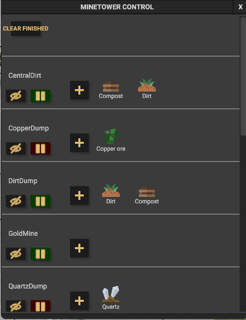

## This is a Captain Of Industry Mod that adds a MinTower Control windo to the game

It shows all MineTower is the game.

Each Minetower hase a  
1/ View button, hoover over it to visually see the tower on the map, push it to move the camera toit.

2/ Status button, shows the current Ready/Paused state

3/ Allowed dumped products, Shows and give possibility to add/remove products which can be dumped by the toer

Genric button : 

Removes all completed Designations. 

# Usage

Use F10 to show the window

# Installation
Extract the included folder in the .ZIP to '%appdata%/Captain of Industry/Mods'. When creating a new game, you will be prompted to select which mods to use.

This Mod can be used in new and existing games.
